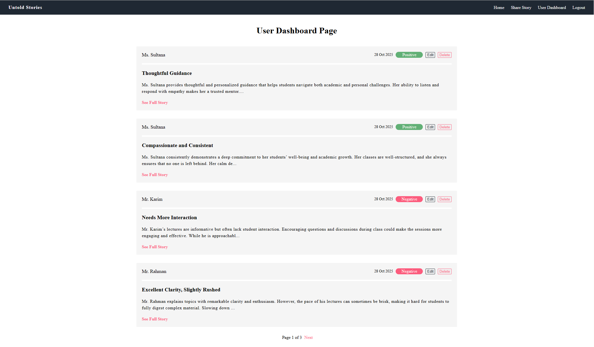
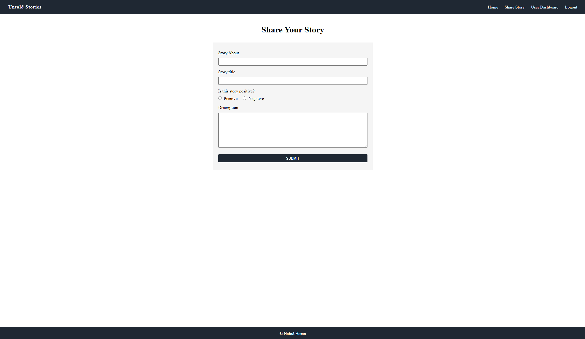
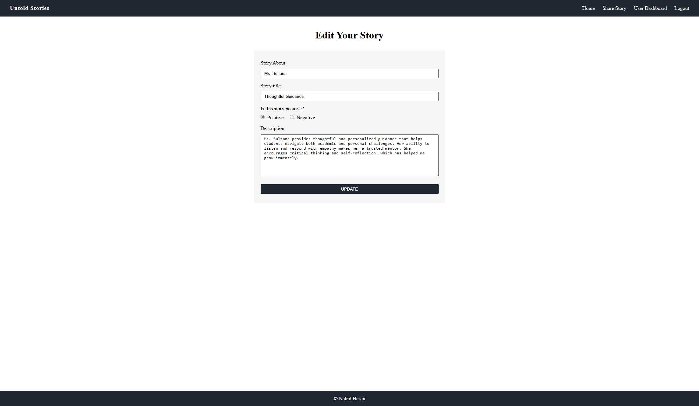
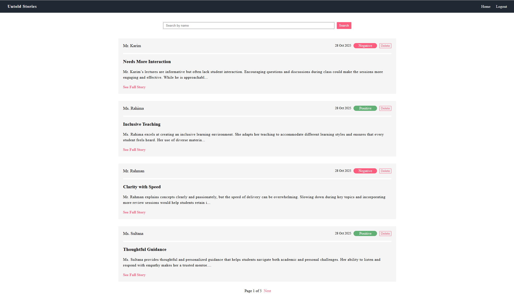
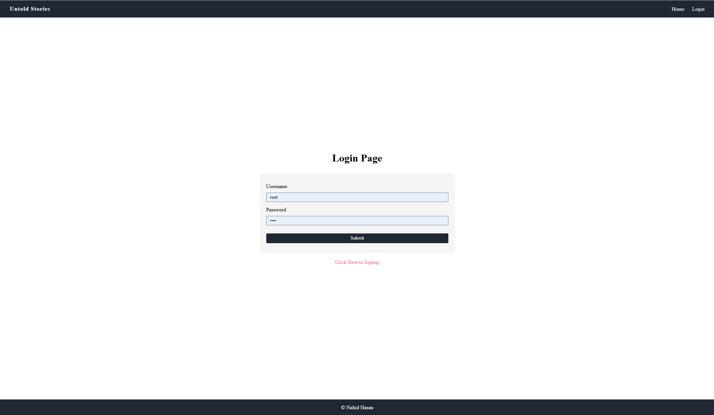
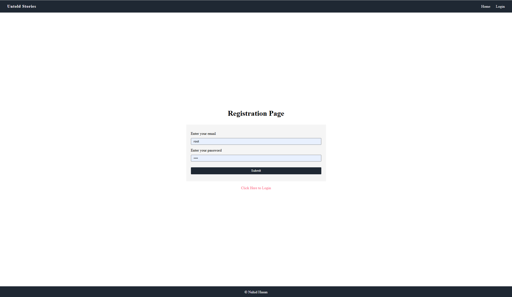

# Untold Stories - Using Spring Boot MVC, Spring Data JPA, Thymeleaf, and H2 Database

A modern, secure Spring Boot & Thymeleaf web application for sharing anonymous student stories. This project provides a safe, anonymous platform where students can share their personal experiences, challenges, and reflections from university life. Built with Spring Security for authentication, Spring Data JPA for object-relational mapping, and H2 database for lightweight data persistence.

---
### ✨ Features-

- **User Registration & Authentication**: Secure registration and login system with password encryption

- **Share Stories Anonymously**: Post personal experiences and stories without revealing your identity to other users or the system

- **Story Management**: Edit and delete your own anonymously posted stories while maintaining full anonymity

- **Browse All Stories**: View a dynamic, card-based feed of all shared stories from the community

- **User Dashboard**: Personal dashboard to manage your profile and view your activity

- **Complete Anonymity**: Posted stories are anonymous to the system - no direct link between user accounts and their stories in the database

- **Security**: Built-in Spring Security with password hashing for secure authentication

- **Responsive Design**: Clean, modern UI that works seamlessly on desktop and mobile devices

- **Session Management**: Secure session handling with logout functionality

---

### 🔐 Security Features-

- **Password Encryption**: Secure password storage using industry-standard hashing algorithms (BCrypt) to protect user credentials

- **Authentication & Authorization**: Spring Security integration for robust user authentication and role-based access control

- **CSRF Protection**: Built-in Cross-Site Request Forgery protection for all state-changing operations

- **Session Management**: Secure HTTP session handling with automatic timeout and invalidation on logout

- **Secure Endpoints**: Role-based access control ensuring users can only access authorized resources

- **Story Anonymity**: Stories are completely anonymous to the system - no direct database relationship between users and their posted stories

- **Story Ownership via Hash**: Stories are linked to users through secure, one-way hash identifiers (using HashUtil), allowing edit/delete functionality while maintaining anonymity

- **SQL Injection Prevention**: Parameterized queries through JPA to prevent SQL injection attacks

[//]: # (- **Input Validation**: Server-side validation of all user inputs to prevent malicious data entry)

---

### 📂 Project Structure-

```
untold-stories/
├── src/
│   ├── main/
│   │   ├── java/com/nahid/main/
│   │   │   ├── config/             # Security configuration
│   │   │   │   └── WebSecurityConfig.java
│   │   │   ├── controller/         # Spring MVC controllers
│   │   │   │   ├── AppController.java
│   │   │   │   └── AuthController.java
│   │   │   ├── model/              # Entity models
│   │   │   │   ├── Story.java
│   │   │   │   └── User.java
│   │   │   ├── repository/         # JPA repositories
│   │   │   │   ├── StoryRepository.java
│   │   │   │   └── UserRepository.java
│   │   │   ├── service/            # Business logic layer
│   │   │   │   ├── CustomUserDetailsService.java
│   │   │   │   ├── StoryService.java
│   │   │   │   └── UserService.java
│   │   │   ├── util/               # Utility classes
│   │   │   │   └── HashUtil.java
│   │   │   └── UntoldStoriesApplication.java
│   │   └── resources/
│   │       ├── static/             # CSS and static assets
│   │       │   ├── css/
│   │       │   │   ├── footer.css
│   │       │   │   ├── global.css
│   │       │   │   ├── home-page.css
│   │       │   │   ├── login-page.css
│   │       │   │   ├── navbar.css
│   │       │   │   ├── post-page.css
│   │       │   │   ├── story-page.css
│   │       │   │   └── user-dashboard-page.css
│   │       │   └── images/
│   │       ├── templates/          # Thymeleaf HTML templates
│   │       │   ├── fragments/
│   │       │   │   ├── footer.html
│   │       │   │   └── navbar.html
│   │       │   ├── home-page.html
│   │       │   ├── login-page.html
│   │       │   ├── post-page.html
│   │       │   ├── registration-page.html
│   │       │   ├── story-page.html
│   │       │   └── user-dashboard-page.html
│   │       ├── application.properties
│   │       └── data.sql
│   └── test/
├── build.gradle
└── README.md
```
---

### 📸 Screenshots-

**Homepage/Stories Feed:**


[//]: # (**Stories Feed:**)

[//]: # ()
[//]: # (![All Stories]&#40;src/main/resources/static/images/user-dashboard-page.png&#41;)

**User Dashboard:**



**Share Story Page:**



**Edit Story Page:**



**Admin Dashboard:**



**Login Page:**



**Registration Page:**



---

### 🛠️ Technologies Used-

- **Java 21**
- **Spring Boot 3.5.6**
- **Spring Boot MVC**
- **Spring Data JPA**
- **Spring Security**
- **H2 Database** (In-memory database)
- **Thymeleaf** (Template engine)
- **Thymeleaf Spring Security Integration**
- **Lombok** (Reduce boilerplate code)
- **Gradle** (Build tool)
- **HTML5 & CSS3**

## 🚀 Getting Started-

### Prerequisites:

- Java 21 or higher
- Gradle (or use the included Gradle wrapper)

### Installation:

1. **Clone the repository:**
   ```bash
   git clone https://github.com/yourusername/untold-stories.git
   cd untold-stories
   ```

2. **Build the project:**
   ```bash
   ./gradlew build
   ```
   Or on Windows:
   ```bash
   gradlew.bat build
   ```

3. **Run the application:**
   ```bash
   ./gradlew bootRun
   ```
   Or on Windows:
   ```bash
   gradlew.bat bootRun
   ```

4. **Access the application:**
   Open your browser and navigate to: `http://localhost:8080`

### Database Configuration:

The application uses H2 in-memory database by default. The database is automatically initialized with sample data from `data.sql`.

**H2 Console Access:**
- URL: `http://localhost:8080/h2-console`
- JDBC URL: Check `application.properties` for the configured URL
- Username: (check `application.properties`)
- Password: (check `application.properties`)

### 📋 Usage:

1. **Register**: Create a new account with your credentials (username, email, password)
2. **Login**: Sign in with your registered username and password through the secure authentication system
3. **Share Story Anonymously**: Navigate to "Post Story" page to share your personal experiences - your identity remains completely anonymous to the system and other users
4. **Browse Stories**: View all anonymously shared stories from the community in a dynamic, card-based feed on the Stories page
5. **Manage Your Stories**: Edit or delete your own anonymously posted stories - ownership is verified through secure hash identifiers while maintaining your anonymity
6. **User Dashboard**: Access your personal dashboard to view your profile information and manage your account
7. **Logout**: Securely logout when you're done - your session will be safely terminated


### 🎯 Future Enhancements:

- [ ] Add categories/tags for stories
- [ ] Implement story search and filtering
- [ ] Add likes/reactions to stories
- [ ] Enable story commenting (while maintaining anonymity)
- [ ] Add story reporting functionality
- [ ] Deploy to cloud platform

[//]: # (## 🤝 Contributing)

[//]: # ()
[//]: # (Contributions, issues, and feature requests are welcome! Feel free to check the issues page.)

[//]: # ()
[//]: # (## 📝 License)

[//]: # ()
[//]: # (This project is for educational purposes and is part of a Spring Boot learning journey.)

### 👤 Author:

**S M Nahid Hasan**

- GitHub: [DevNahidHasan](https://github.com/DevNahidHasan)

### 🙏 Acknowledgments:

- Built as a practice project to reinforce learning of Spring Boot MVC, Spring Security, and Thymeleaf
- Special thanks to [Rezaur Rahman Sir](https://github.com/DevRezaur) for guidance and instruction

---

⭐ If you find this project helpful, please consider giving it a star!
